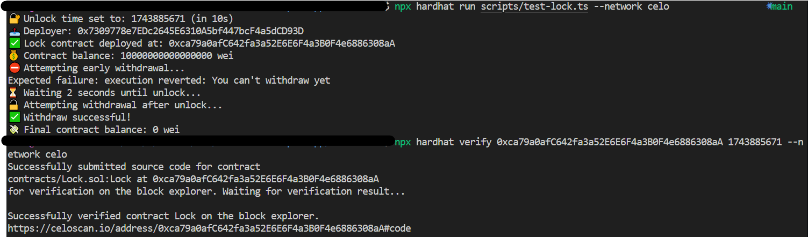

# Smart Contract on Celo

This folder contains the smart contract that could lock some funds on CELO until a future dates.

## Instructions to run

### Deploy the contract and directly test it works on CELO

```bash
npx hardhat run scripts/test-lock.ts --network celo
```

### Deploy the contract

```bash
npx hardhat run scripts/deploy-lock.ts --network celo
```

### To verify the contract
```bash
npx hardhat verify <CONTRACT_ADDRESS>  <CONSTRUCTOR_ARGS> --network celo
```

You may need to copy the config file to deploy on celo or other network
```bash
cp deployment-config.development.js deployment-config.<NETWORK>.js
```

### Deployment result

Verified link: https://celoscan.io/address/0xca79a0afC642fa3a52E6E6F4a3B0F4e6886308aA#code

